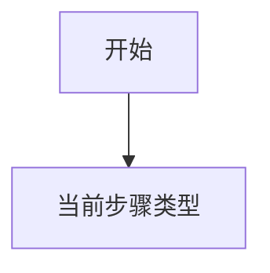

# gsrb

GUI Script Repair with Backtrace

## usage

确保已安装 python3.10 或以上版本。安装 `virtualenv` 或其他虚拟环境并在虚拟环境中操作

确保 `当前python环境/Scripts` 在 `%PATH%` 中

在项目根目录下运行 `pip install -e .`，该命令会将本项目作为模块以 editable 的形式安装在 pip 所处的 python 环境中

项目提供的功能以命令行程序的形式调用，具体参见 `pyproject.toml` 中 `[project.scripts]` 一节

Android 虚拟机使用 Android Studio 提供的 ADV，具体配置为

* Android 11.0 Google APIs | x86_64
* 机型为 pixel 2
* 分辨率为 1080x1920

理论上只要是 Android 11 的模拟器或实机均可，如果其他配置出现问题，请参考上文给出的配置

确保 `adb.exe`，`aapt.exe` 位于路径上

如果在配置 python 环境中出现问题，尝试设置环境变量 `PYTHONUTF8` 为 `1`

## common

通用数据结构

## 匹配算法

* 优先确定匹配：三属性里至少两个不为空且相等。
* 确定匹配后为确定模糊匹配：三属性里 id 相似，且 text 与 desc 两两组合中有至少一组相似
* 确定模糊匹配之后为父节点匹配，此时只要求三属性里至少一个不为空且相等（父节点一般为容器，没有 text）
* 父节点匹配后为根据同一父节点的模糊匹配
* 随后是可能匹配

## 修复算法

* 当前步骤类型
    * 断言：直接执行，如果失败则退出
    * 操作：尝试执行
        * 执行成功：当前步骤加入已执行序列，下一步
        * 执行失败
            * 如果有下一步，尝试直接执行下一步（对应新版本长度小于旧版本）
                * 执行成功：下一步加入已执行序列，再下一步
                * 执行失败：回退，开始在当前界面进行探索
            * 如果没有下一步，则开始在当前界面进行探索

探索：

对于每个当前界面的可交互控件，交互后，分别尝试当前步骤与下一步步骤（如果有），能执行成功则加入已执行序列

尝试优先级

* 尝试执行当前步骤
* 当前界面匹配寻找当前步骤
* 尝试执行下一步
* 当前界面匹配寻找下一步（如果有）

## 基于递归

回溯法递归尝试所有可能性？

需要剪枝

如果有多个结果，选择一个返回

## TODO

探索时遇到断言失效，不能直接退出修复

需要去除无用操作（例子：旧版本点击控件进入子菜单，新版本无子菜单，原本控件文本变为标题文本）

需要考虑在没有断言的情况下如何保证测试意图的保留：状态相似度的判断

## prompt

Android 界面是一系列组件的集合，组件的 class 属性是其类型，组件的 text 属性是其显示的文本，组件的 content-desc 属性是其被阅读屏幕的软件识别时的内容，组件的 resource-id 属性是开发人员用于唯一标注该组件的属性，组件的 bounds 的属性是其在屏幕上所占据的区域。
在下一条请求中我将以 jsonl 格式向你提供一个 Android 界面的定义。数据中每一行都是一个 json object，代表一个组件。json 对象的 c 字段为 class 属性，t 字段为 text 属性，d 字段为 content-desc 属性，r 字段为 resource-id 属性，b 字段为 bounds 属性。前四个字段的类型都为字符串，bounds 属性的类型也是字符串，但是格式形如 `[x0,y0][x1,y1]`，其中 x0，y0 是组件所占区域左上角的横纵坐标，x1, y1 是组件所占区域右下角的横纵坐标。坐标格式均为整数，界面的原点位于左上角，x 轴向右延伸，y 轴向下延伸。界面宽度为 1080，高度为 1920。
你的任务是从提供的组件列表中选择三个你认为最能代表应用程序当前界面的组件，并以 jsonl 格式输出，一行输出一个组件。不需要其他额外的输出。

## 演示

步骤增加：auxio 01

步骤减少：atimetracker 02

步骤平移：ligntning 01
